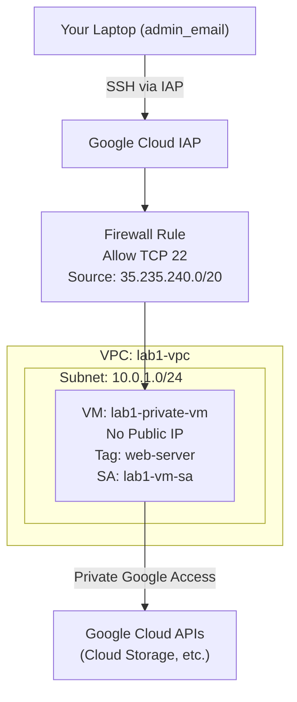

# 📑 Lab 1: Secure Networking & Private Access

<strong>Goal</strong>: Prove that a VM with no public internet can still reach Google APIs and be managed securely.

## 🎯 Exam Objectives Covered

- <strong>Networking</strong>: Private Google Access, IAP Firewall ranges (35.235.240.0/20).
- <strong>Security</strong>: IAM Least Privilege, Service Accounts, IAP Tunneling.
- <strong>Storage</strong>: Uniform Bucket-Level Access, Cloud Storage CLI.

## Technical Graph

```bash
terraform graph -type=plan | dot -Tpng > simple-graph.png
```

## Simple diagram (Mermaid)



## Deploying with Terraform

```bash
terraform apply
```

### Verification Outputs

```
service_account_email = "lab1-vm-sa@project-2efec330-6519-41ae-ab3.iam.gserviceaccount.com"
ssh_command = "gcloud compute ssh lab1-private-vm --tunnel-through-iap --zone=us-central1-a"
test_bucket_name = "ace-lab-bucket-72d7c76b"
verification_command = "gsutil cat gs://ace-lab-bucket-72d7c76b/hello-ace.txt"
vm_internal_ip = "10.0.1.2"
vm_name = "lab1-private-vm"
```

### The Final Test: Private Google Access

```bash
gsutil cat gs://[YOUR_BUCKET_NAME]/hello-ace.txt
```

## 🔍 Troubleshooting Logic for the ACE Exam:

- <strong>SUCCESS:</strong> If you see the text, Private Google Access is ON. The VM used Google’s internal "back door" to reach the bucket.
- <strong>FAILURE (Hang/Timeout):</strong> If it freezes, Private Google Access is OFF. The VM is trying to use the public internet, but it has no public IP/Gateway.
- <strong>FAILURE (403 Forbidden):</strong> If you see a permission error, the Networking is fine, but the IAM Role on the Service Account is missing or wrong.

## Cleanup

```bash
terraform destroy
```
