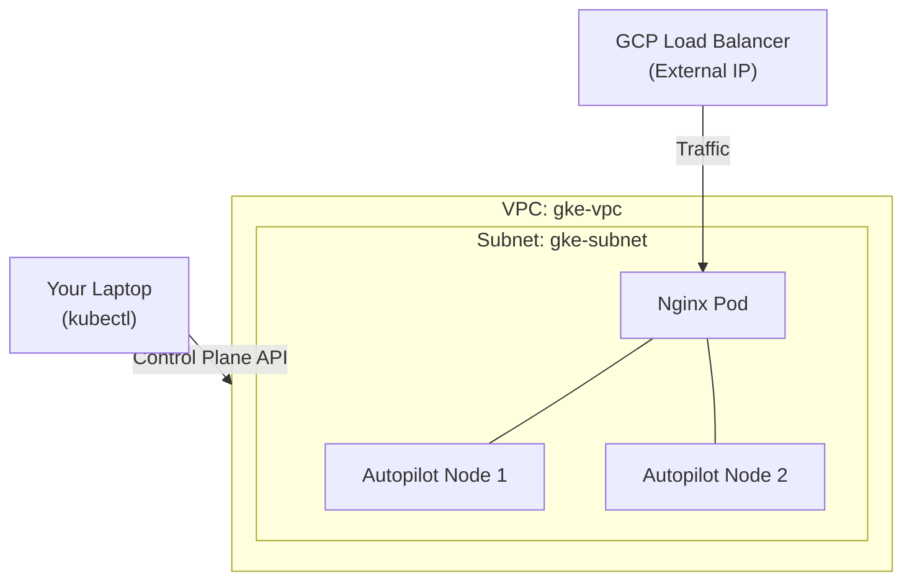

## 📑 Lab 2: GKE Operations & Managed Scaling

Goal: Deploy a production-ready GKE Autopilot cluster and practice zero-downtime rollbacks.

## 🎯 Exam Objectives Covered

- Domain 3.2: Deploying and Implementing GKE Clusters (Autopilot vs. Standard).
- Domain 4.1: Managing GKE Resources (Deployments, Services, Pods).
- Domain 4.2: Troubleshooting GKE (Rollouts, ImagePullBackOff).
- Domain 5.2: Configuring Private Clusters (Question 33).

## 🛠️ Key Concepts Learned

- GKE Autopilot (Q19): Google manages the nodes and scaling. Google automatically assigns resources (CPU/RAM) to your pods.
- VPC-Native (Best Practice): Using secondary IP ranges for Pods and Services to ensure scalability and better performance.
- Private Clusters (Q33): Nodes have no public IPs. They are hidden from the internet but can be reached via a secure internal master endpoint.
- Kubernetes vs. GCP Load Balancer: Creating a type: LoadBalancer Service in Kubernetes triggers the creation of a physical GCP Network Load Balancer.

## Technical Graph

```bash
terraform graph -type=plan | dot -Tpng > simple-graph.png
```

## Simple Diagram (Mermaid)



## Deploying with Terraform

```bash
terraform apply
```

## Verification Outputs

```bash
connect_cluster = "gcloud container clusters get-credentials ace-autopilot-cluster --region us-central1"
nginx_external_ip = "34.x.x.x"
```

## 🧪 Operations Test (The "ACE" Skills)## 1. Connect to your Cluster

```bash
gcloud container clusters get-credentials ace-autopilot-cluster --region us-central1
```

## 2. Access via Browser

Paste the nginx_external_ip from your Terraform output into your browser. You should see "Welcome to nginx!".

## 3. Simulate a "Bad Update" (Q8 Logic)

```bash
kubectl set image deployment/web-server nginx=nginx:broken-typo
```

## 4. Check Pod Status

```bash
kubectl get pods
```

Observation: You will see ImagePullBackOff. The "Self-Healing" nature of the deployment is stuck because it cannot find the new image.

## 5. The Emergency Rollback (The Fastest Fix)

```bash
kubectl rollout undo deployment/web-server
```

Observation: Kubernetes immediately restores the previous stable version. Refresh your browser to verify.

## 🔍 Troubleshooting Logic for the ACE Exam:

- ErrImagePull / ImagePullBackOff: This indicates a typo in the image name, a missing tag, or lack of permission to the registry.
- Pending LoadBalancer IP: This is normal; it takes Google 1–2 minutes to provision the physical hardware and assign a public IP.
- Self-Healing: If you delete a single Pod, the Deployment will automatically recreate it to maintain your replica count.

## Cleanup

```bash
terraform destroy
```
