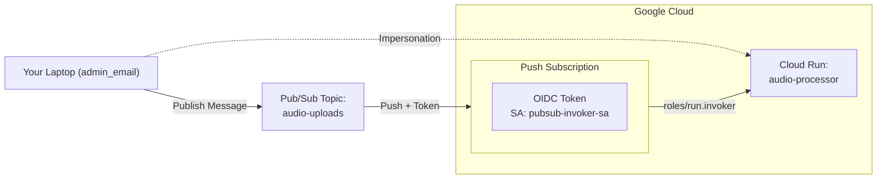

## 📑 Lab 3: Serverless & Event-Driven Security

Goal: Deploy an event-driven architecture using Cloud Run and Pub/Sub while mastering Service Account Impersonation.

## 🎯 Exam Objectives Covered

- Serverless: Cloud Run (Question 15), Event-driven triggers.
- Messaging: Pub/Sub Push subscriptions, OIDC tokens.
- Security: Service Account Impersonation (Question 3), roles/run.invoker.

## Technical Graph

```bash
terraform graph -type=plan | dot -Tpng > simple-graph.png
```

## Simple diagram (Mermaid)



## Deploying with Terraform

```bash
terraform apply
```

## Verification Outputs

```
cloud_run_url = "https://run.app"
impersonation_command = "gcloud config set auth/impersonate_service_account cloud-run-processor-sa@project-id.iam.gserviceaccount.com"
pubsub_test_command = "gcloud pubsub topics publish audio-uploads --message='Hello Cloud Run'"
```

## The Final Test: Event-Driven Trigger

# 1. Send a message to the topic

```bash
gcloud pubsub topics publish audio-uploads --message='Hello Cloud Run'
```

# 2. Check Cloud Run logs to see the received message

```bash
gcloud beta run services logs read audio-processor --region=us-central1 --limit=10
```

## 🔍 Troubleshooting Logic for the ACE Exam:

- SUCCESS: If Cloud Run logs show the message, the Push Subscription and IAM Invoker role are correct (Question 15).
- FAILURE (403 Forbidden in Logs): Pub/Sub is reaching Cloud Run, but the pubsub-invoker-sa lacks the roles/run.invoker permission.
- FAILURE (Impersonation): If gcloud config set auth/impersonate... fails, your user lacks the roles/iam.serviceAccountTokenCreator role on that SA (Question 3).

# Verify Service Account Impersonation (Question 3)

Now, prove you can "act as" the Cloud Run Service Account to perform administrative tasks without a JSON key.

Impersonate

```bash
gcloud config set auth/impersonate_service_account cloud-run-processor-sa@[YOUR_PROJECT_ID].iam.gserviceaccount.com
```

Verify

```bash
gcloud config list auth/impersonate_service_account
```

Look for the `*` next to the Service Account email.

## Cleanup

# Unset impersonation first

```bash
gcloud config unset auth/impersonate_service_account
```

# Destroy resources

```bash
terraform destroy
```
