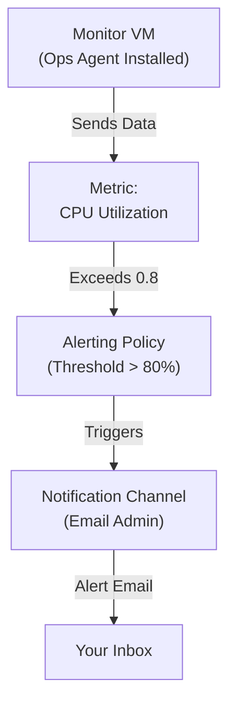

# 📑 Lab 4: Cloud Monitoring & Alerting

## 🎯 Goal

Automate the installation of the Ops Agent and configure a real-time alerting policy to notify admins of system stress.

---

## 🎯 Exam Objectives Covered

* **Monitoring (Question 26):**
  Creating alerting policies, setting thresholds, and notification channels
* **Operations:**
  Installing and verifying the Google Cloud Ops Agent
* **Logging:**
  Ensuring system and application logs are flowing to Cloud Logging

---

## 🧭 Technical Graph

```bash
terraform graph -type=plan | dot -Tpng > simple-graph.png
```

---

## 🔷 Simple Diagram (Mermaid)



---

## 🚀 Deploying with Terraform

```bash
terraform apply
```

---

## 📤 Verification Outputs

```text
vm_name = "monitor-test-vm"
ssh_command = "gcloud compute ssh monitor-test-vm --zone=us-central1-a"
cpu_stress_command = "timeout 300s cat /dev/urandom > /dev/null &"
```

---

## 🧪 Final Test: Triggering the Alert

### 1. SSH into the VM and start the stress test

```bash
# This command maxes out the CPU for 5 minutes
timeout 300s cat /dev/urandom > /dev/null &
```

---

### 2. Monitor the alert in Cloud Console

Go to:

**Monitoring → Alerting**

* An **incident** will open once CPU stays above 80% for ~60 seconds

---

### 3. Check your email

* Within **2–3 minutes**, you should receive a notification
* Sender: **Google Cloud Alerts**
* Includes the documentation message from Terraform

---

## 🔍 Troubleshooting Logic (ACE Exam Style)

### ✅ SUCCESS

* You receive the email
* Ops Agent is working
* Notification channel is correctly linked

---

### ❌ FAILURE: No Alert

Check if Ops Agent is running:

```bash
sudo systemctl status google-cloud-ops-agent
```

---

### ❌ FAILURE: No Email

* Go to **Monitoring → Notification Channels**
* Ensure:

  * Email is **verified**
  * `email_address` is correct

---

## 🧹 Cleanup

```bash
terraform destroy
```