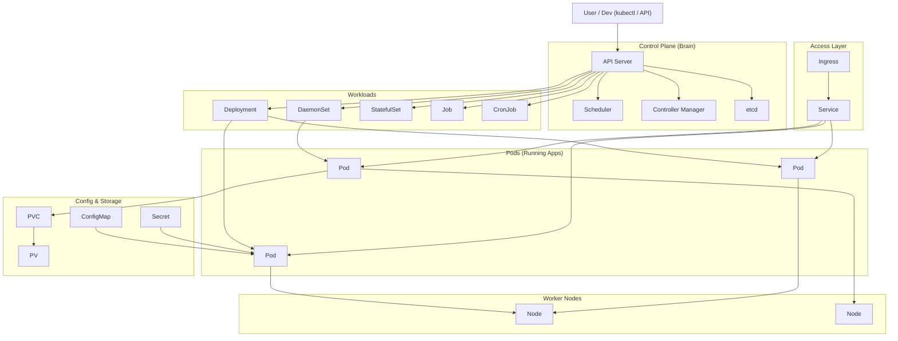
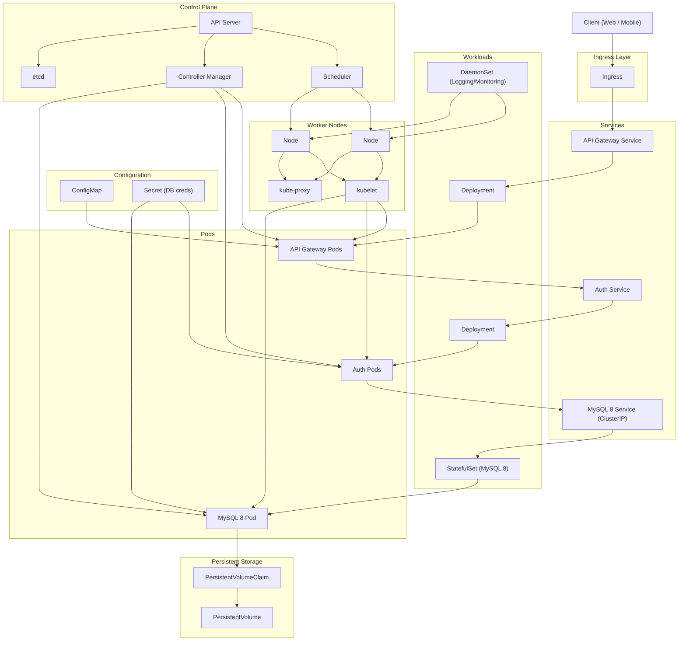
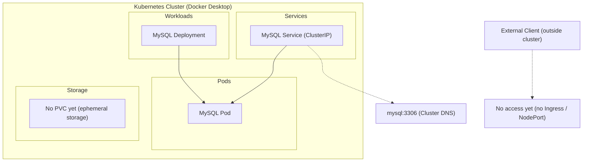
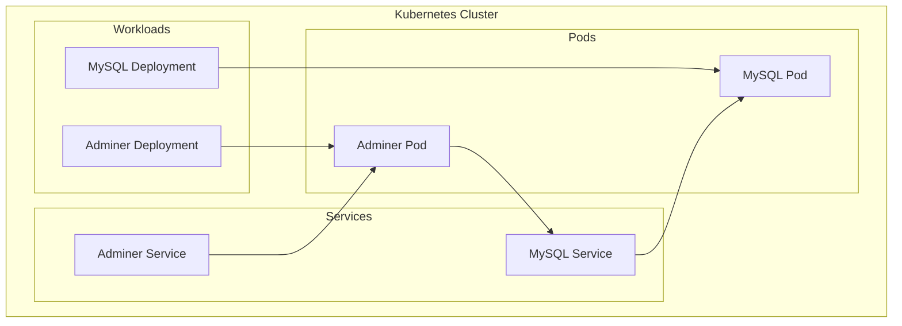
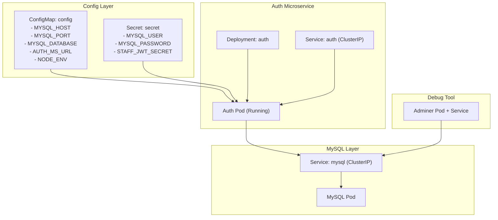
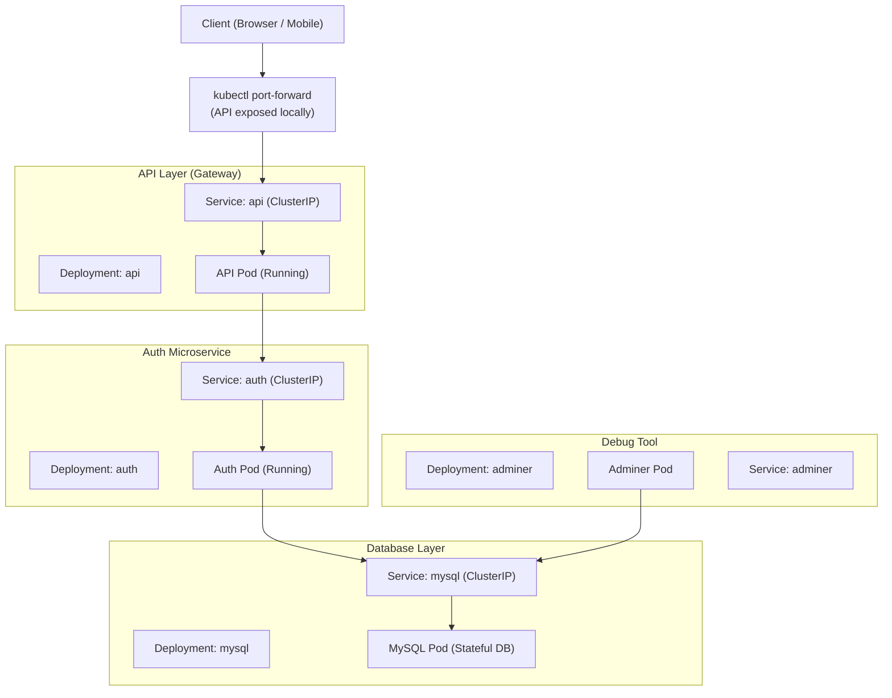

Here are the **key Kubernetes terms you should know**, explained in simple English and grouped so they actually make sense together.

---

# 🧱 Core building blocks

### 📦 Pod

- Smallest unit in Kubernetes
- Usually runs **one container**

👉 Think: _“one running app instance”_

---

### 🧩 Node

- A machine (VM or physical server)
- Where pods actually run

---

### 🏢 Cluster

- A group of nodes managed together

---

# 🎛️ Workload controllers (how apps run)

These are SUPER important—this is where people get confused.

---

### 🚀 Deployment

- Runs your app
- Keeps a **set number of pods alive**
- Handles updates (rolling updates)

👉 “Keep 3 copies of my app running”

---

### 🔁 ReplicaSet

- Ensures a specific number of pods exist
- Usually managed by Deployment (you rarely touch it directly)

---

### 👻 DaemonSet

- Runs **1 pod on every node**

👉 “Put this on every machine”

---

### 🧠 StatefulSet

- For apps that need **stable identity** (like databases)

👉 Each pod:

- has a fixed name
- keeps its own storage

---

### ⏱️ Job

- Runs a task **once and finishes**

---

### ⏰ CronJob

- Runs jobs on a schedule

👉 Like Linux cron

---

# 🌐 Networking

---

### 🔗 Service

- Gives a stable way to access pods
- Pods can die/change → Service stays the same

👉 Think: _“permanent address for a changing set of pods”_

---

### 🌍 Ingress

- Lets users access your app from outside the cluster (HTTP/HTTPS)

👉 Like a smart router for web traffic

---

# 💾 Storage

---

### 💽 Volume

- Storage attached to a pod (temporary or persistent)

---

### 📀 PersistentVolume (PV)

- Actual storage resource

---

### 📎 PersistentVolumeClaim (PVC)

- Request for storage

👉 “I need 10GB” → Kubernetes finds it

---

# ⚙️ Configuration

---

### 📄 ConfigMap

- Stores **non-sensitive config**
  (e.g., environment variables)

---

### 🔐 Secret

- Stores sensitive data
  (passwords, API keys)

---

# 🧠 Cluster internals (good to know)

---

### 🧠 Control Plane

- Brain of Kubernetes
- Makes decisions

---

### 🗄️ etcd

- Database storing cluster state

---

### 📡 kubelet

- Agent running on each node

---

# 🧩 Helpful mental grouping

Instead of memorizing randomly, think like this:

- **Run apps** → Pod, Deployment, DaemonSet, StatefulSet
- **Connect apps** → Service, Ingress
- **Store data** → Volume, PV, PVC
- **Configure apps** → ConfigMap, Secret
- **System stuff** → Node, Cluster, Control Plane

---

# 🧠 If you only remember 6 things

If you're just starting, focus on:

- Pod
- Deployment
- Service
- DaemonSet
- ConfigMap
- Ingress

That’s enough to understand most real setups.



### Full microservices + Kubernetes keyword-rich diagram (API Gateway, Auth, MySQL + most core K8s objects):




kubectl apply -f k8s/namespace.yaml -R -f k8s/
kubectl get all -n k8s-dev
kubectl delete -f k8s/namespace.yaml -R -f k8s/

### Full Explanation

---

# 1. 🧑‍💻 Client Layer

```text
Client (Web / Mobile)
```

This is your frontend:

- Browser (React / Next.js / etc.)
- Mobile app

👉 It only talks to the system through the network entry point.

---

# 2. 🚪 Ingress Layer (Entry Door)

```text
Ingress
```

This is the **single entry point into Kubernetes**.

Think of it as:

- Reverse proxy (like NGINX Ingress Controller)
- Routes external traffic to internal services

Flow:

```text
Client → Ingress → API Gateway Service
```

---

# 3. 🔀 Services Layer (Stable Network Names)

```text
API Gateway Service
Auth Service
MySQL Service (ClusterIP)
```

These are Kubernetes **Service objects**.

Key idea:

- Services give **stable DNS names**
- Pods can change, services don’t

### What each does:

### API Gateway Service

- Entry service for your backend
- Receives all client traffic

### Auth Service

- Handles login, JWT, identity, etc.

### MySQL Service (ClusterIP)

- Internal-only database access
- NOT exposed outside cluster

---

# 4. ⚙️ Workloads Layer (How apps run)

```text
Deployment (API, Auth)
StatefulSet (MySQL)
DaemonSet (Logging)
```

This defines HOW pods are managed.

### 📦 Deployment (API + Auth)

Used for stateless apps:

- API Gateway
- Auth service

Features:

- Auto scaling
- Rolling updates
- Multiple replicas

---

### 🧠 StatefulSet (MySQL)

Used for databases:

- Stable identity (mysql-0, mysql-1)
- Persistent storage required

---

### 📊 DaemonSet (Logging / Monitoring)

Runs **1 pod per node**
Used for:

- logs
- metrics (Prometheus node exporter, Fluent Bit)

---

# 5. 🧱 Pods Layer (Actual Running Containers)

```text
API Gateway Pods
Auth Pods
MySQL Pod
```

This is where your containers actually run.

Important idea:

- Deployment → creates Pods
- StatefulSet → creates stable Pods
- DaemonSet → creates node-based Pods

---

# 6. 💾 Storage Layer (Database persistence)

```text
PVC → PV
```

### PersistentVolumeClaim (PVC)

- Request for storage (e.g. 10GB disk)

### PersistentVolume (PV)

- Actual disk on node/cloud

Flow:

```text
MySQL Pod → PVC → PV (disk)
```

This is why DB data survives restarts.

---

# 7. 🔐 Config Layer

```text
ConfigMap
Secret
```

### ConfigMap

- non-sensitive config
- e.g. feature flags, URLs

### Secret

- sensitive data:
  - DB password
  - JWT secret

Your diagram shows:

```text
Secret → Auth Pod + DB Pod
```

---

# 8. 🖥️ Worker Nodes (Where everything runs)

```text
Node1 / Node2
kubelet
kube-proxy
```

### Node

A machine (VM or physical server)

### kubelet

- Agent on node
- Starts/stops pods

### kube-proxy

- Handles networking inside cluster

---

# 9. 🎛️ Control Plane (Brain of Kubernetes)

```text
API Server
Scheduler
Controller Manager
etcd
```

### API Server

- entry point for kubectl / system

### Scheduler

- decides WHERE pods run (Node1 or Node2)

### Controller Manager

- ensures desired state matches actual state

### etcd

- cluster database (stores everything)

---

# 10. 🔄 Request Flow (MOST IMPORTANT)

Let’s trace your system:

### 1. Client request

```text
Client → Ingress
```

### 2. Routing

```text
Ingress → API Gateway Service
```

### 3. API Gateway

```text
API Gateway Pod → Auth Service
```

### 4. Auth flow

```text
Auth Pod → MySQL Service → MySQL Pod
```

### 5. DB persistence

```text
MySQL Pod → PVC → PV (disk)
```

---

# 11. 🧠 How your docker-compose maps to this diagram

Your Docker Compose is basically a **local version of these Kubernetes objects**:

| Docker Compose  | Kubernetes Equivalent |
| --------------- | --------------------- |
| service         | Deployment            |
| mysql container | StatefulSet           |
| depends_on      | Service dependency    |
| ports           | NodePort / Ingress    |
| env vars        | ConfigMap / Secret    |

---

# 12. ⚠️ Important Reality Check (for Docker Desktop)

When you move this to Kubernetes locally:

- `mysql:3306` → becomes `mysql.default.svc.cluster.local`
- `auth:50051` → service DNS inside cluster
- no `depends_on` anymore → replaced by readiness probes
- volumes become PVCs (not local folder mounts)

---

Here’s a clean **step-by-step Kubernetes build plan** for your exact system (API Gateway + Auth + MySQL), starting from zero and growing gradually. Each step is meant to be **deployable and testable on Docker Desktop Kubernetes**.

---

# 🧭 Phase 1 — Kubernetes basics (foundation)

## 🟢 Step 1: Verify cluster

- Check Kubernetes is running

```bash
kubectl get nodes
```

✔ Goal: confirm `docker-desktop` node exists

---

## 🟢 Step 2: MySQL only (first workload)

- Create:
  - Deployment (MySQL)
  - Service (ClusterIP)

✔ Goal:

- MySQL pod running
- accessible as `mysql:3306` inside cluster

---

## 🟢 Step 3: Add Adminer (debug tool)

- Deployment + Service
- Expose via port-forward

✔ Goal:

- GUI can connect to MySQL

---

# 🧭 Phase 2 — First microservice

## 🟡 Step 4: Add Auth service

- Deployment
- Service
- Connect to MySQL via Kubernetes DNS

✔ Goal:

- Auth connects to DB
- runs migrations successfully

---

## 🟡 Step 5: Test service-to-service DNS

- Verify:
  - `mysql`
  - `auth`

✔ Goal:

- Auth can resolve MySQL by service name

---

# 🧭 Phase 3 — Multi-service architecture

## 🟠 Step 6: Add API service

- Deployment
- Service
- Connect API → Auth via DNS (`auth:50051`)

✔ Goal:

- API calls Auth successfully

---

## 🟠 Step 7: Internal full flow test

- API → Auth → MySQL

✔ Goal:

- end-to-end backend flow works inside cluster

---

# 🧭 Phase 4 — Production Kubernetes features

## 🟡 Step 8: Add ConfigMap

- Move environment variables out of deployments

✔ Goal:

- config separated from code

---

## 🟡 Step 9: Add Secret

- DB password
- JWT secret

✔ Goal:

- no sensitive data in YAML files

---

## 🟡 Step 10: Add PersistentVolumeClaim (PVC)

- Attach storage to MySQL

✔ Goal:

- data persists after pod restart

---

# 🧭 Phase 5 — External access

## 🔵 Step 11: Install Ingress controller

- nginx ingress on Docker Desktop

✔ Goal:

- cluster has HTTP entry point

---

## 🔵 Step 12: Add Ingress for API

- route `/` → API service

✔ Goal:

- access API via browser instead of port-forward

---

# 🧭 Phase 6 — Production structure

## 🔴 Step 13: Refactor into folder structure

- apps/
- infra/
- ingress/

✔ Goal:

- clean architecture (like real companies)

---

## 🔴 Step 14: Add namespaces

- dev namespace
- isolate resources

✔ Goal:

- environment separation

---

# 🧭 Phase 7 — Scaling & realism

## 🔥 Step 15: Add replicas

- API scale to 2–3 pods
- Auth scale to 2 pods

✔ Goal:

- load balancing works via Service

---

## 🔥 Step 16: Add readiness/liveness probes

- health checks for all services

✔ Goal:

- Kubernetes self-healing works

---

## 🔥 Step 17: Add StatefulSet (upgrade MySQL)

- replace Deployment → StatefulSet

✔ Goal:

- stable DB identity + safe scaling model

---

# 🧭 Phase 8 — “real cluster simulation”

## 🚀 Step 18: Full architecture test

Flow:

```text
Client → Ingress → API → Auth → MySQL
```

✔ Goal:

- full system behaves like production cluster

---

# 🧠 Summary roadmap (super compact)

```text
1. Cluster ready
2. MySQL
3. Adminer
4. Auth
5. API
6. Service DNS working
7. ConfigMap
8. Secret
9. PVC
10. Ingress
11. Folder structure refactor
12. Namespaces
13. Scaling
14. Probes
15. StatefulSet
16. Full end-to-end system
```

## Step 2

run:

```
kubectl apply -f k8s/mysql/deployment.yaml
kubectl apply -f k8s/mysql/service.yaml
```

Verify everything
Check pod:

```
kubectl get pods
```

Check service:

```
kubectl get svc
```

Check logs:

```
kubectl logs deployment/mysql
```

Test MySQL inside Kubernetes:

```
kubectl run -it --rm mysql-client \
  --image=mysql:8.0 \
  -- mysql -h mysql -uroot -proot
```

What you just learned (IMPORTANT):
You now have:

### ✔ Pod abstraction

- MySQL container running in Kubernetes

### ✔ Service abstraction

- stable network identity (mysql)

### ✔ Internal DNS system

- no IPs, no localhost

### ✔ Cluster networking

- pod-to-pod communication works



## Step 3

🧠 Why ClusterIP?

Because we will access it via:

kubectl port-forward

(Not exposed publicly yet)

🚀 4. Deploy Step 3

Run:

kubectl apply -f k8s/adminer/deployment.yaml
kubectl apply -f k8s/adminer/service.yaml
📊 5. Verify pods
kubectl get pods

Expected:

mysql-xxx Running
adminer-xxx Running
🌐 6. Access Adminer (IMPORTANT STEP)

Run port-forward:

kubectl port-forward svc/adminer 8080:8080

Then open:

http://localhost:8080



## Step 4



## Step 5
