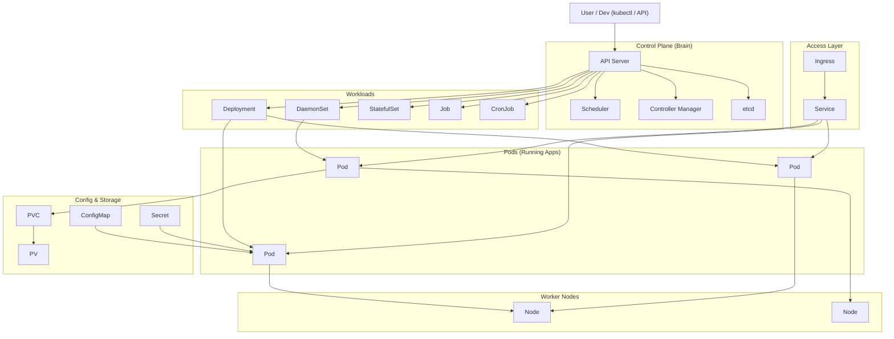
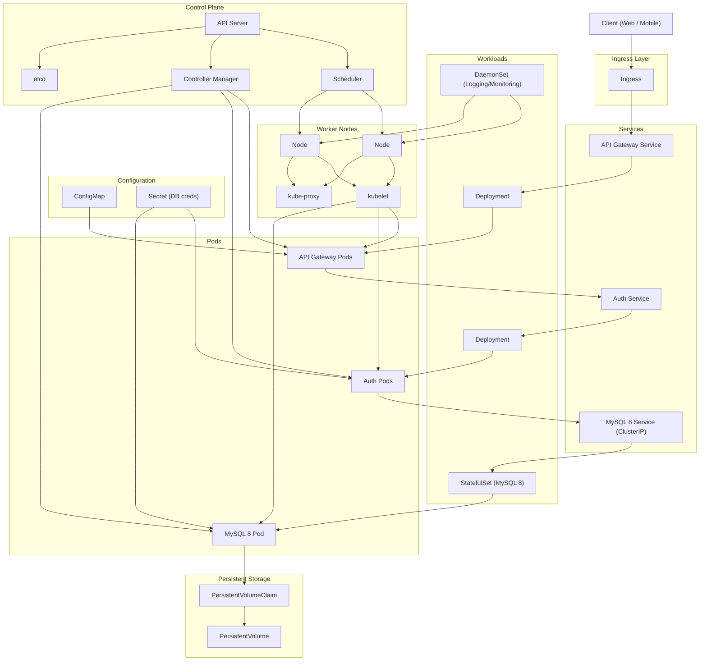

Here are the **key Kubernetes terms you should know**, explained in simple English and grouped so they actually make sense together.

---

# 🧱 Core building blocks

### 📦 Pod

* Smallest unit in Kubernetes
* Usually runs **one container**

👉 Think: *“one running app instance”*

---

### 🧩 Node

* A machine (VM or physical server)
* Where pods actually run

---

### 🏢 Cluster

* A group of nodes managed together

---

# 🎛️ Workload controllers (how apps run)

These are SUPER important—this is where people get confused.

---

### 🚀 Deployment

* Runs your app
* Keeps a **set number of pods alive**
* Handles updates (rolling updates)

👉 “Keep 3 copies of my app running”

---

### 🔁 ReplicaSet

* Ensures a specific number of pods exist
* Usually managed by Deployment (you rarely touch it directly)

---

### 👻 DaemonSet

* Runs **1 pod on every node**

👉 “Put this on every machine”

---

### 🧠 StatefulSet

* For apps that need **stable identity** (like databases)

👉 Each pod:

* has a fixed name
* keeps its own storage

---

### ⏱️ Job

* Runs a task **once and finishes**

---

### ⏰ CronJob

* Runs jobs on a schedule

👉 Like Linux cron

---

# 🌐 Networking

---

### 🔗 Service

* Gives a stable way to access pods
* Pods can die/change → Service stays the same

👉 Think: *“permanent address for a changing set of pods”*

---

### 🌍 Ingress

* Lets users access your app from outside the cluster (HTTP/HTTPS)

👉 Like a smart router for web traffic

---

# 💾 Storage

---

### 💽 Volume

* Storage attached to a pod (temporary or persistent)

---

### 📀 PersistentVolume (PV)

* Actual storage resource

---

### 📎 PersistentVolumeClaim (PVC)

* Request for storage

👉 “I need 10GB” → Kubernetes finds it

---

# ⚙️ Configuration

---

### 📄 ConfigMap

* Stores **non-sensitive config**
  (e.g., environment variables)

---

### 🔐 Secret

* Stores sensitive data
  (passwords, API keys)

---

# 🧠 Cluster internals (good to know)

---

### 🧠 Control Plane

* Brain of Kubernetes
* Makes decisions

---

### 🗄️ etcd

* Database storing cluster state

---

### 📡 kubelet

* Agent running on each node

---

# 🧩 Helpful mental grouping

Instead of memorizing randomly, think like this:

* **Run apps** → Pod, Deployment, DaemonSet, StatefulSet
* **Connect apps** → Service, Ingress
* **Store data** → Volume, PV, PVC
* **Configure apps** → ConfigMap, Secret
* **System stuff** → Node, Cluster, Control Plane

---

# 🧠 If you only remember 6 things

If you're just starting, focus on:

* Pod
* Deployment
* Service
* DaemonSet
* ConfigMap
* Ingress

That’s enough to understand most real setups.

### Full microservices + Kubernetes keyword-rich diagram (API Gateway, Auth, MySQL + most core K8s objects):
