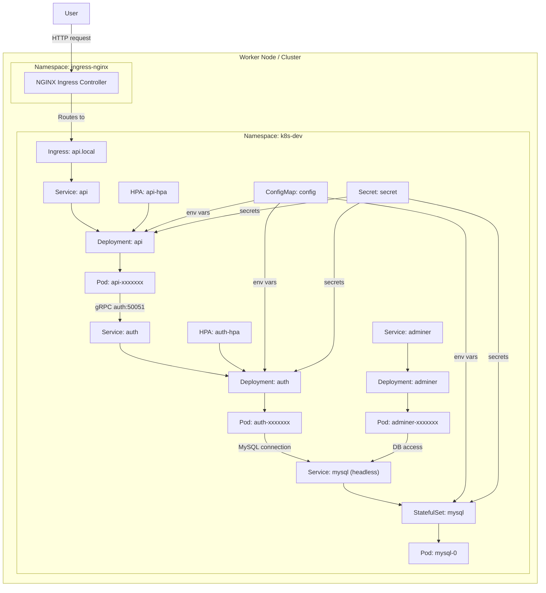

# Kubernetes Infrastructure Overview

This directory contains the Kubernetes manifests and helper scripts for the `k8s-dev` stack.

## Architecture

The cluster is organized into a single namespace: `k8s-dev`.

Components:

- `cluster/namespace.yaml` creates the `k8s-dev` namespace.
- `config/config.yaml` provides a `ConfigMap` for database and service configuration.
- `config/secret.yaml` provides a `Secret` for MySQL credentials and JWT secret.
- `databases/mysql/statefulset.yaml` deploys MySQL as a `StatefulSet` with persistent storage.
- `databases/mysql/service.yaml` exposes MySQL via a headless `ClusterIP` service called `mysql`.
- `services/auth/deployment.yaml` deploys the `auth` microservice and injects database and environment variables.
- `services/auth/service.yaml` exposes the `auth` service internally on port `50051`.
- `services/api/deployment.yaml` deploys the `api` microservice and configures it to call `auth`.
- `services/api/service.yaml` exposes the `api` service internally on port `3000`.
- `services/api/hpa.yaml` defines an HPA for the `api` deployment.
- `services/api/ingress.yaml` exposes the `api` service externally through an NGINX ingress at host `api.local`.
- `services/auth/hpa.yaml` defines an HPA for the `auth` deployment.
- `tools/adminer/` deploys Adminer for database inspection on port `8080`.
- `up.sh` installs the ingress controller and applies all manifests.
- `down.sh` deletes the `k8s-dev` namespace.

## Deployment Flow

1. `up.sh` installs the `ingress-nginx` controller.
2. Creates the namespace and configuration resources.
3. Deploys MySQL, then `auth`, `api`, and Adminer. The `services/*` directories also include HPA manifests for `api` and `auth`.
4. `api` is reachable via the ingress at `http://api.local`.

## Enable Kubernetes + Metrics Support

Docker Desktop already includes Kubernetes, but metrics-server is often missing or broken by default.

### Install metrics-server
```bash
kubectl apply -f https://github.com/kubernetes-sigs/metrics-server/releases/latest/download/components.yaml
```

### Fix for Docker Desktop (IMPORTANT)
Edit metrics-server:
```bash
KUBE_EDITOR="nano" kubectl edit deployment metrics-server -n kube-system
```
Add this to container args:
```yaml
args:
  - --kubelet-insecure-tls
```

Then restart:
```bash
kubectl rollout restart deployment metrics-server -n kube-system
```

### Verify it works
```bash
kubectl top nodes
```

### Test HPA with CPU load
Apply load inside a target pod and watch the autoscaler react:
```bash
kubectl exec -it $(kubectl get pods -n k8s-dev -l app=api -o jsonpath='{.items[0].metadata.name}') -n k8s-dev -- sh
apk add --no-cache stress-ng
stress-ng --cpu 2 --cpu-load 90 --timeout 300s
```

Then monitor HPA status:
```bash
kubectl get hpa -n k8s-dev
kubectl describe hpa api-hpa -n k8s-dev
kubectl describe hpa auth-hpa -n k8s-dev
```

## Runtime Relationships

- `api` calls `auth` over gRPC using `AUTH_MS_URL=auth:50051`.
- `auth` connects to MySQL using settings from `config` and `secret`.
- `adminer` can be used to inspect the MySQL database inside the cluster.
- `api` and `auth` both use shared `ConfigMap` and `Secret` values.

## Namespaces

- `k8s-dev` — holds the application stack, database, and Adminer.
- `ingress-nginx` — holds the NGINX ingress controller installed by `up.sh`.

## Pod-level View

The diagram also shows the pod layer for each deployment/statefulset, representing the actual running pod identities behind the services.

## Diagram



## Usage

- Start the stack: `./up.sh`
- Stop the stack: `./down.sh`
- Confirm resources: `kubectl get pods -n k8s-dev`

## Notes

- The `api` and `auth` deployments use local images (`backend-api:latest`, `backend-auth:latest`) and set `imagePullPolicy: Never`.
- The ingress uses the `nginx` ingress class and maps host `api.local` to the `api` service.
- The MySQL service is headless (`clusterIP: None`) so the `StatefulSet` gets stable network identity.
