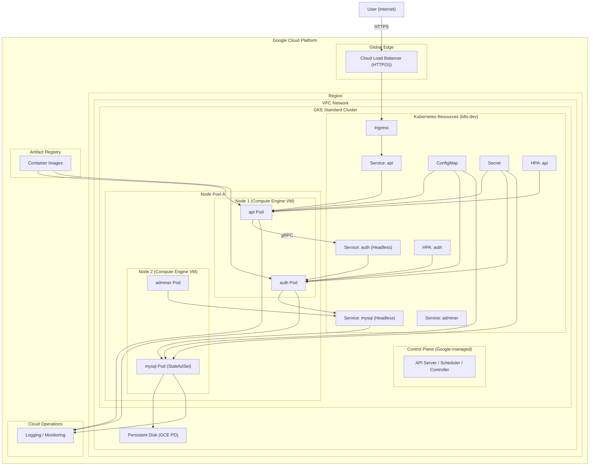

I want to fulfill this gke standard structure

I want to fulfill this setup




now I already finished for CICD to push images; api and auth into artifact registory.

here is my terraform folder structure
|
gcp-ace/lab-6-gke-standard/terraform$ ls -R
.:
main.tf  modules  outputs.tf  providers.tf  terraform.tfstate  terraform.tfstate.backup  terraform.tfvars  terraform.tfvars.example  variables.tf

./modules:
apis  artifact  build

./modules/apis:
main.tf  outputs.tf  variables.tf

./modules/artifact:
main.tf  outputs.tf  variables.tf

./modules/build:
iam.tf  main.tf  outputs.tf  variables.tf

here is my k8s folder structure

gcp-ace/lab-6-gke-standard/k8s$ ls -R
.:
cluster  config  databases  services  tools

./cluster:
namespace.yaml

./config:
config.yaml  secret.yaml

./databases:
mysql

./databases/mysql:
deployment.yaml.bk  pvc.yaml.bk  service.yaml  statefulset.yaml

./services:
api  auth

./services/api:
deployment.yaml  hpa.yaml  ingress.yaml  service.yaml

./services/auth:
deployment.yaml  hpa.yaml  service.yaml

./tools:
adminer

./tools/adminer:
deployment.yaml  service.yaml

here is architecture of k8s

## Architecture

The cluster is organized into a single namespace: `k8s-dev`.

Components:

- `cluster/namespace.yaml` creates the `k8s-dev` namespace.
- `config/config.yaml` provides a `ConfigMap` for database and service configuration.
- `config/secret.yaml` provides a `Secret` for MySQL credentials and JWT secret.
- `databases/mysql/statefulset.yaml` deploys MySQL as a `StatefulSet` with persistent storage.
- `databases/mysql/service.yaml` exposes MySQL via a headless `ClusterIP` service called `mysql`.
- `services/auth/deployment.yaml` deploys the `auth` microservice and injects database and environment variables.
- `services/auth/service.yaml` exposes the `auth` service internally on port `50051` as a headless service for gPRC load balancing.
- `services/api/deployment.yaml` deploys the `api` microservice and configures it to call `auth`.
- `services/api/service.yaml` exposes the `api` service internally on port `3000`.
- `services/api/hpa.yaml` defines an HPA for the `api` deployment.
- `services/api/ingress.yaml` exposes the `api` service externally through an NGINX ingress at host `api.local`.
- `services/auth/hpa.yaml` defines an HPA for the `auth` deployment.
- `tools/adminer/` deploys Adminer for database inspection on port `8080`.

gimme prompt to continue next steps

+++++++++++++++++++++++
You’re at the stage where your **CI/CD + image registry is done**, and your repo already contains a fairly complete **Terraform + Kubernetes manifest structure**. The next step is to move from “definitions” → **actual running GKE Standard cluster + workload deployment + networking + observability validation**.

Here’s a **copy-paste prompt you can reuse (for ChatGPT or future planning)** to continue cleanly:

---

## ✅ NEXT STEPS PROMPT (GKE STANDARD IMPLEMENTATION)

```text
I already completed CI/CD that pushes my API and Auth images to Artifact Registry.

Now I want to continue implementing my GKE Standard architecture using Terraform + Kubernetes manifests.

Current setup:
- Terraform: creates modules for GKE, Artifact Registry, and build/IAM
- Kubernetes manifests:
  - namespace: k8s-dev
  - config/secret for app config
  - mysql StatefulSet + headless service + PVC
  - api + auth microservices (Deployments + Services + HPA)
  - ingress exposing API externally
  - adminer tool for DB inspection

Target architecture matches a standard GKE setup with:
- GKE Standard cluster (regional or zonal)
- Node pool for workloads
- Cloud Load Balancer (Ingress)
- Artifact Registry images for api/auth
- Persistent Disk for MySQL
- HPA scaling for api/auth
- Observability via Cloud Logging/Monitoring

What I need next:
1. Step-by-step guide to deploy the GKE Standard cluster using Terraform
   - VPC integration (if needed)
   - node pools configuration
   - service accounts & IAM permissions

2. How to wire Kubernetes manifests into the cluster
   - kubectl vs Terraform Kubernetes provider vs Helm (recommend best approach)

3. How to configure:
   - Ingress (GKE HTTP(S) Load Balancer)
   - Static external IP (optional)
   - DNS mapping (api.local or real domain)

4. How to properly connect:
   - api → auth service (gRPC)
   - auth → mysql StatefulSet
   - persistent disk binding

5. How to deploy safely:
   - namespace creation
   - secrets/config injection
   - rollout strategy

6. How to validate everything:
   - kubectl commands
   - logs
   - HPA scaling test
   - ingress access test

7. Best practice improvements:
   - security hardening (Workload Identity, least privilege)
   - separation of environments (dev/staging/prod)
   - CI/CD integration with kubectl or ArgoCD

Please continue from where I left off and guide me step-by-step.
```

---

## 💡 If you want the *real next engineering step (not just prompt)*

You are currently at this point:

### ✅ DONE

* CI/CD → Artifact Registry images
* Kubernetes manifests written
* Terraform structure exists

### 🔥 NEXT REAL STEPS (order matters)

1. **Create GKE Standard cluster (Terraform)**

   * region/zonal choice
   * node pool
   * service account + IAM

2. **Enable required APIs**

   * container.googleapis.com
   * compute.googleapis.com
   * artifactregistry.googleapis.com

3. **Connect kubectl to cluster**

   * `gcloud container clusters get-credentials`

4. **Deploy namespace + config + secret first**

5. **Deploy MySQL StatefulSet + PVC (critical dependency)**

6. **Deploy auth service**

7. **Deploy api service**

8. **Deploy ingress last**

9. **Test full flow**

---

## ⚠️ One important architectural note (worth fixing early)

Your current design says:

* MySQL runs inside cluster ✔️ (fine for lab)
* Auth talks directly to MySQL ✔️
* API talks to Auth via gRPC ✔️

That’s good, but make sure:

* MySQL is **not exposed outside cluster**
* auth uses **ClusterIP (headless is fine only for StatefulSet, not DB service necessity)**

---

If you want next, I can also:

* generate your **Terraform GKE cluster module**
* or fix your **ingress for GKE Load Balancer properly**
* or convert your setup into **Helm / ArgoCD GitOps (production-grade)**
