# GKE Standard — Infrastructure Overview

This lab deploys a production-style backend stack on a GKE Standard cluster, provisioned with Terraform and delivered via Cloud Build CI/CD.

## Architecture

```mermaid
flowchart TB
  user["User (Internet)"]

  subgraph "Google Cloud Platform"
    direction TB

    subgraph "Global Edge"
      glb["Cloud Load Balancer (HTTP(S))"]
    end

    subgraph "Region"
      subgraph "VPC Network"

        subgraph "GKE Standard Cluster"

          subgraph "Control Plane (Google-managed)"
            cp["API Server / Scheduler / Controller"]
          end

          subgraph "Node Pool A"
            direction LR

            subgraph "Node 1 (Compute Engine VM)"
              api_pod["api Pod"]
              auth_pod["auth Pod"]
            end

            subgraph "Node 2 (Compute Engine VM)"
              mysql_pod["mysql Pod (StatefulSet)"]
              adminer_pod["adminer Pod"]
            end
          end

          subgraph "Kubernetes Resources (k8s-dev)"
            api_ing["Ingress"]
            api_svc["Service: api"]
            auth_svc["Service: auth (Headless)"]
            mysql_svc["Service: mysql (Headless)"]
            adminer_svc["Service: adminer"]
            config["ConfigMap"]
            secret["Secret"]
            api_hpa["HPA: api"]
            auth_hpa["HPA: auth"]
          end

        end

        pd["Persistent Disk (GCE PD)"]
      end
    end

    subgraph "Artifact Registry"
      images["Container Images"]
    end

    subgraph "Cloud Operations"
      monitoring["Logging / Monitoring"]
    end
  end

  %% Traffic
  user -->|HTTPS| glb
  glb --> api_ing
  api_ing --> api_svc
  api_svc --> api_pod

  %% Internal
  api_pod -->|gRPC| auth_svc
  auth_svc --> auth_pod

  auth_pod --> mysql_svc
  mysql_svc --> mysql_pod
  mysql_pod --> pd

  adminer_pod --> mysql_svc

  %% Config
  config --> api_pod
  config --> auth_pod
  config --> mysql_pod

  secret --> api_pod
  secret --> auth_pod
  secret --> mysql_pod

  %% Scaling
  api_hpa --> api_pod
  auth_hpa --> auth_pod

  %% Images
  images --> api_pod
  images --> auth_pod

  %% Observability
  api_pod --> monitoring
  auth_pod --> monitoring
  mysql_pod --> monitoring
```



## Components

**Terraform (`terraform/`)**

- `modules/apis/` — enables required GCP APIs (GKE, Compute, Artifact Registry, Cloud Build).
- `modules/vpc/` — creates a VPC network and subnet with secondary IP ranges for GKE pods and services.
- `modules/gke/` — provisions a GKE Standard cluster, Node Pool A, a dedicated node SA, and a global static IP for the Ingress.
- `modules/artifact/` — creates an Artifact Registry Docker repository named `backend`.
- `modules/build/` — creates Cloud Build triggers for `api` and `auth`, with a dedicated SA that can push to Artifact Registry and deploy to GKE.

**Kubernetes (`k8s/`)**

- `cluster/namespace.yaml` — creates the `k8s-dev` namespace.
- `config/config.yaml` — `ConfigMap` for database host, port, name, and service URLs.
- `config/secret.yaml` — `Secret` for MySQL credentials and JWT secret.
- `databases/mysql/statefulset.yaml` — deploys MySQL as a `StatefulSet`. Uses `storageClassName: standard-rwo` (GCE Persistent Disk, pd-balanced) with `10Gi` storage — GCE PD minimum.
- `databases/mysql/service.yaml` — headless `ClusterIP` service (`clusterIP: None`) for stable MySQL DNS identity.
- `services/auth/deployment.yaml` — deploys the `auth` gRPC microservice. Pulls image from Artifact Registry (`imagePullPolicy: Always`); runs `prisma migrate deploy` on startup.
- `services/auth/service.yaml` — headless service (`clusterIP: None`) exposing `auth` on port `50051` for gRPC load balancing.
- `services/auth/hpa.yaml` — HPA for the `auth` deployment, scales on CPU at 60% target.
- `services/api/deployment.yaml` — deploys the `api` gateway. Pulls image from Artifact Registry (`imagePullPolicy: Always`); connects to `auth` over gRPC at `auth:50051`.
- `services/api/service.yaml` — `NodePort` service on port `3000`. Must be `NodePort` (not `ClusterIP`) so the external GCE Load Balancer can reach the pods through the nodes.
- `services/api/backendconfig.yaml` — configures the GCE LB health check to probe `GET /api` instead of the default `GET /`. Required because the NestJS app uses a global `/api` prefix — without this the LB marks the backend `UNHEALTHY` and drops all traffic.
- `services/api/ingress.yaml` — GCE Ingress (`kubernetes.io/ingress.class: gce`) with `defaultBackend` routing all traffic to the `api` service. Bound to the Terraform-reserved static IP via `kubernetes.io/ingress.global-static-ip-name`.
- `services/api/hpa.yaml` — HPA for the `api` deployment, scales on CPU at 60% target.
- `tools/adminer/` — deploys Adminer for database inspection on port `8080`. Only accessible via `kubectl port-forward` (no public Ingress).

**CI/CD (`cicd/`)**

- `cloudbuild-api-gateway.yaml` — builds, pushes, and deploys the `api` image on every push.
- `cloudbuild-auth-ms.yaml` — builds, pushes, and deploys the `auth` image on every push.

## Deployment Order

### 1. Provision GCP infrastructure with Terraform

```bash
cd terraform
cp terraform.tfvars.example terraform.tfvars
# fill in terraform.tfvars with your project_id, github_owner, etc.

terraform init
terraform apply
```

Creates: VPC, GKE cluster, Node Pool A, Artifact Registry, Cloud Build triggers, static IP, and all IAM bindings.

### 2. Connect kubectl to the cluster

```bash
gcloud container clusters get-credentials gke-standard \
  --zone us-central1-a \
  --project YOUR_PROJECT_ID
```

### 3. Apply base Kubernetes resources (once)

```bash
kubectl apply -f k8s/cluster/namespace.yaml
kubectl apply -f k8s/config/config.yaml
kubectl apply -f k8s/config/secret.yaml
```

### 4. Apply all remaining Kubernetes resources (once)

```bash
kubectl apply -f k8s/databases/mysql/
kubectl apply -f k8s/services/api/
kubectl apply -f k8s/services/auth/
kubectl apply -f k8s/tools/adminer/
```

### 5. CI/CD takes over from here

Every `git push` to the trigger branch fires Cloud Build which:

1. Builds the Docker image
2. Pushes it to Artifact Registry
3. Runs `kubectl set image` to roll out the new image on the cluster

## Runtime Relationships

- `api` calls `auth` over gRPC using `AUTH_MS_URL=auth:50051`.
- `auth` connects to MySQL using settings from `config` and `secret`, and runs `prisma migrate deploy` on startup.
- `adminer` can be used to inspect the MySQL database inside the cluster.
- `api` and `auth` both share the same `ConfigMap` and `Secret`.
- The GCE Load Balancer routes public traffic to `api` via the Ingress and static IP.
- Cloud Logging and Monitoring collect logs and metrics from all pods automatically.

## Notes

- The `api` and `auth` deployments use `imagePullPolicy: Always` and pull images from Artifact Registry. Images are updated on every CI/CD run via `kubectl set image`.
- The `api` Service must be `NodePort` (not `ClusterIP`) for the GCE Ingress to route traffic correctly.
- The MySQL service is headless (`clusterIP: None`) so the StatefulSet gets a stable DNS identity (`mysql.k8s-dev.svc.cluster.local`).
- The static IP name (`gke-standard-ingress-ip`) is reserved by Terraform and referenced in the Ingress annotation. Run `terraform output ingress_ip_address` to get the address.

## Teardown

> **Important:** Run `terraform destroy` directly will fail. The GKE Ingress controller creates GCE resources (Network Endpoint Groups, Load Balancer backends) outside of Terraform. These must be deleted first or the VPC deletion will be blocked.

**Step 1 — Delete Kubernetes resources** (triggers GKE to clean up GCE LB resources):
```bash
kubectl delete -f k8s/services/api/
kubectl delete -f k8s/services/auth/
kubectl delete -f k8s/databases/mysql/
kubectl delete -f k8s/tools/adminer/
kubectl delete -f k8s/config/
kubectl delete -f k8s/cluster/
```

**Step 2 — Wait for GCE LB cleanup** (2–3 minutes):
```bash
gcloud compute network-endpoint-groups list --project=YOUR_PROJECT_ID
```

Wait until the list is empty, then proceed.

**Step 3 — Destroy Terraform resources:**
```bash
terraform destroy
```
