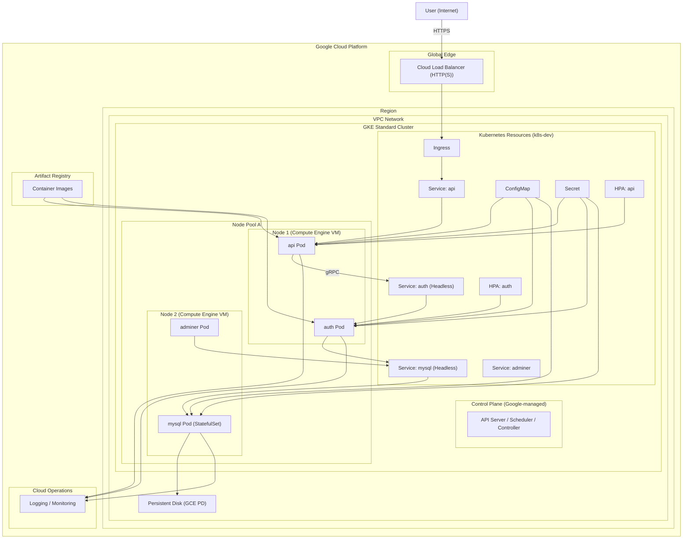

```mermaid
flowchart TB
  user["User (Internet)"]

  subgraph "Google Cloud Platform"
    direction TB

    subgraph "Global Edge"
      glb["Cloud Load Balancer (HTTP(S))"]
    end

    subgraph "Region"
      subgraph "VPC Network"

        subgraph "GKE Standard Cluster"

          subgraph "Control Plane (Google-managed)"
            cp["API Server / Scheduler / Controller"]
          end

          subgraph "Node Pool A"
            direction LR

            subgraph "Node 1 (Compute Engine VM)"
              api_pod["api Pod"]
              auth_pod["auth Pod"]
            end

            subgraph "Node 2 (Compute Engine VM)"
              mysql_pod["mysql Pod (StatefulSet)"]
              adminer_pod["adminer Pod"]
            end
          end

          subgraph "Kubernetes Resources (k8s-dev)"
            api_ing["Ingress"]
            api_svc["Service: api"]
            auth_svc["Service: auth (Headless)"]
            mysql_svc["Service: mysql (Headless)"]
            adminer_svc["Service: adminer"]
            config["ConfigMap"]
            secret["Secret"]
            api_hpa["HPA: api"]
            auth_hpa["HPA: auth"]
          end

        end

        pd["Persistent Disk (GCE PD)"]
      end
    end

    subgraph "Artifact Registry"
      images["Container Images"]
    end

    subgraph "Cloud Operations"
      monitoring["Logging / Monitoring"]
    end
  end

  %% Traffic
  user -->|HTTPS| glb
  glb --> api_ing
  api_ing --> api_svc
  api_svc --> api_pod

  %% Internal
  api_pod -->|gRPC| auth_svc
  auth_svc --> auth_pod

  auth_pod --> mysql_svc
  mysql_svc --> mysql_pod
  mysql_pod --> pd

  adminer_pod --> mysql_svc

  %% Config
  config --> api_pod
  config --> auth_pod
  config --> mysql_pod

  secret --> api_pod
  secret --> auth_pod
  secret --> mysql_pod

  %% Scaling
  api_hpa --> api_pod
  auth_hpa --> auth_pod

  %% Images
  images --> api_pod
  images --> auth_pod

  %% Observability
  api_pod --> monitoring
  auth_pod --> monitoring
  mysql_pod --> monitoring
```
