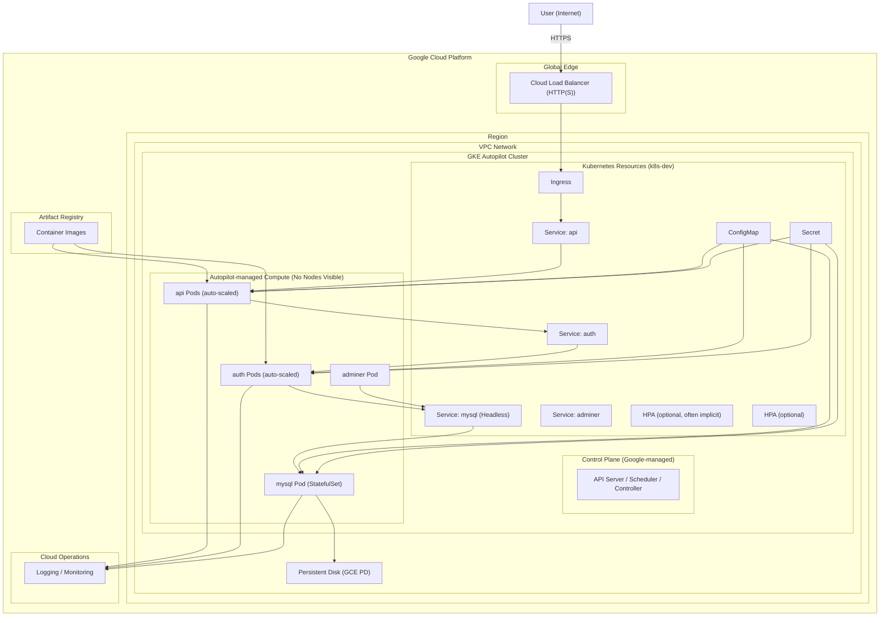

```mermaid
flowchart TB
  user["User (Internet)"]

  subgraph "Google Cloud Platform"
    direction TB

    subgraph "Global Edge"
      glb["Cloud Load Balancer (HTTP(S))"]
    end

    subgraph "Region"
      subgraph "VPC Network"

        subgraph "GKE Autopilot Cluster"

          subgraph "Control Plane (Google-managed)"
            cp["API Server / Scheduler / Controller"]
          end

          subgraph "Autopilot-managed Compute (No Nodes Visible)"
            api_pod["api Pods (auto-scaled)"]
            auth_pod["auth Pods (auto-scaled)"]
            mysql_pod["mysql Pod (StatefulSet)"]
            adminer_pod["adminer Pod"]
          end

          subgraph "Kubernetes Resources (k8s-dev)"
            api_ing["Ingress"]
            api_svc["Service: api"]
            auth_svc["Service: auth"]
            mysql_svc["Service: mysql (Headless)"]
            adminer_svc["Service: adminer"]
            config["ConfigMap"]
            secret["Secret"]
            api_hpa["HPA (optional, often implicit)"]
            auth_hpa["HPA (optional)"]
          end

        end

        pd["Persistent Disk (GCE PD)"]
      end
    end

    subgraph "Artifact Registry"
      images["Container Images"]
    end

    subgraph "Cloud Operations"
      monitoring["Logging / Monitoring"]
    end
  end

  %% Traffic
  user -->|HTTPS| glb
  glb --> api_ing
  api_ing --> api_svc
  api_svc --> api_pod

  %% Internal
  api_pod --> auth_svc
  auth_svc --> auth_pod

  auth_pod --> mysql_svc
  mysql_svc --> mysql_pod
  mysql_pod --> pd

  adminer_pod --> mysql_svc

  %% Config
  config --> api_pod
  config --> auth_pod
  config --> mysql_pod

  secret --> api_pod
  secret --> auth_pod
  secret --> mysql_pod

  %% Images
  images --> api_pod
  images --> auth_pod

  %% Observability
  api_pod --> monitoring
  auth_pod --> monitoring
  mysql_pod --> monitoring
```